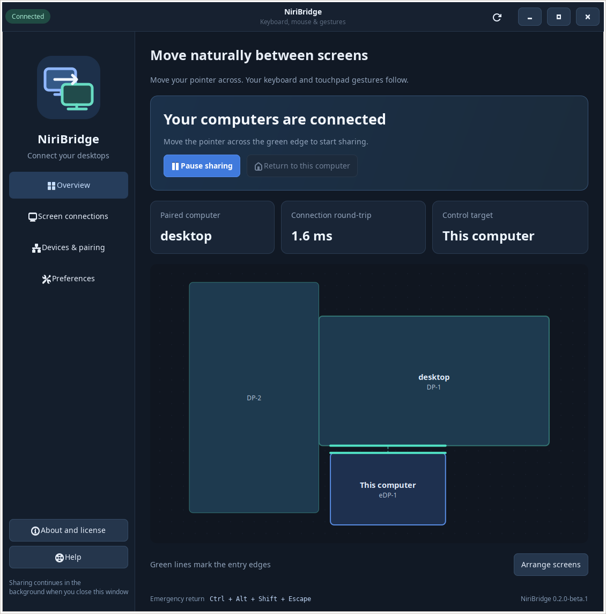

# NiriBridge

English · [简体中文](README.zh-CN.md)

Keep your keyboard and touchpad gestures with your pointer across two Niri desktops.

NiriBridge shares keyboard, mouse and touchpad input between two Ubuntu/Niri/Wayland computers. Each computer renders its own desktop. Move the pointer through a configured screen edge and the keyboard follows automatically; three-finger workspace switching and four-finger overview gestures follow the same destination.

**Version 0.2 adds a native desktop interface** with live connection status, pause/resume controls, pairing, screen arrangement and input preferences. English is the default interface language, with a complete Simplified Chinese catalog. The language follows your desktop by default and can be changed in Preferences without restarting input sharing or losing unsaved edits.

This is an early beta for Ubuntu 26.04 and Niri 26.04. It is licensed under **GPL-3.0-or-later**; see [LICENSE](LICENSE) and [third-party notices](THIRD_PARTY_NOTICES.md). Supported behavior and remaining acceptance limits are documented below.

## Desktop interface

Download the Ubuntu 26.04 x86_64 archive from [GitHub Releases](https://github.com/blackdream1890/niri-bridge/releases), verify it against `SHA256SUMS`, and extract it. From the extracted directory:

```sh
python3 scripts/install.py
niri-bridge-ui
```

For a source checkout, first run `cargo build --locked --release`. The separate source release archive includes the locked Rust dependencies for an offline Cargo build after installing the required toolchain and system packages.

The installer adds **NiriBridge** to your application launcher. It preserves existing identities, pairing files, settings, device permissions and customized user service definitions. When upgrading a running backend, update both computers together; `--no-restart` can stage the files before restarting both services.



The interface provides:

- **Overview:** authenticated connection state, the current control target and measured connection round-trip time.
- **Screen connections:** drag the other computer's screen group, choose entry displays and adjust entry ranges. Saving synchronizes both computers over their existing encrypted connection.
- **Devices & pairing:** export the local public pairing file, inspect the other computer's file and verify its fingerprint before trusting it.
- **Preferences:** choose physical input devices, enable native touchpad gestures, manage automatic startup and select the interface language.
- **System tray:** open the interface, pause/resume sharing or quit the interface. Closing the window leaves the background sharing service running.

The UI manages the standard `niri-bridge.service` user service. A manually started instance is identified separately so the interface can avoid acting on the wrong process.

## Pair and connect

1. Open NiriBridge on both computers. Existing configurations load automatically; otherwise create an identity and select the input devices to share.
2. Export a pairing file from each computer and import it on the other. Compare the full SHA-256 fingerprint with the other computer's display before confirming trust. Private keys remain on their original computer.
3. Set one computer to **wait for a connection**. On the other, enter its reachable LAN address and matching port.
4. Allow access to the selected input devices if needed, then start sharing on both computers.
5. In **Screen connections**, drag the other computer into position, choose the entry displays and save. Both sides validate their current configuration before applying the change.

Screen connections configure the crossing between computers. The monitor arrangement within each computer continues to follow its Niri configuration.

The complete [installation and operating guide](docs/setup.md) covers dependencies, device access, firewall rules and recovery.

## Everyday behavior

| Physical input | Pointer destination | Keyboard, pointer and gestures control |
| --- | --- | --- |
| Laptop keyboard and touchpad | Laptop | Laptop |
| Laptop keyboard and touchpad | Desktop | Desktop |
| Desktop keyboard and mouse | Desktop | Desktop |
| Desktop keyboard and mouse | Laptop | Laptop |

- **Ctrl+Alt+Shift+Escape** immediately returns control to the input source. Ordinary Escape is sent normally.
- Physical input on the receiving computer ends the shared control session and restores local control.
- Sharing pauses when either session is locked, inactive or unavailable. Unlocking allows a new crossing without automatically resuming the previous capture.
- Existing KDE Connect clipboard synchronization can continue. NiriBridge does not add a second clipboard mechanism.

To stop the background service on a computer:

```sh
systemctl --user stop niri-bridge.service
```

## Implementation and validation

The Rust backend uses paired-certificate TLS 1.3. Selected physical keyboard events are captured before source-side input-method filtering; uinput injection on the destination supports its Niri bindings and input method. Native touchpad frames retain their timing and are routed through a local or remote virtual touchpad, allowing Niri to interpret gestures on the destination. Mouse input uses Wayland capture and virtual pointer protocols.

The GTK desktop UI communicates with the backend over a private, same-user Unix socket. It does not open a web server. Settings retain existing TOML comments, reject stale edits and are written atomically. Pairing changes require an explicit fingerprint check in the interface.

Bidirectional input, native three/four-finger gestures and corrected touchpad responsiveness have been verified on the two initial Ubuntu/Niri devices. Isolated compositor tests cover control transfer, recovery and paired configuration updates. Long suspend cycles, all input-method editing scenarios and every extended gesture remain areas for continued testing. See [test coverage and commands](docs/testing.md).

## Project documents

- [Installation and usage](docs/setup.md)
- [Design and safety boundaries](docs/design.md)
- [Testing](docs/testing.md)
- [Release procedure](docs/releasing.md)
- [Contributing and translations](CONTRIBUTING.md)
- [Security](SECURITY.md)
- [Requirements and acceptance checklist](docs/requirements.md)

The first supported development target is Ubuntu 26.04 with Niri 26.04. Other compositors and operating systems have not been validated. The repository pins Rust 1.98.1 with `rust-toolchain.toml`.
