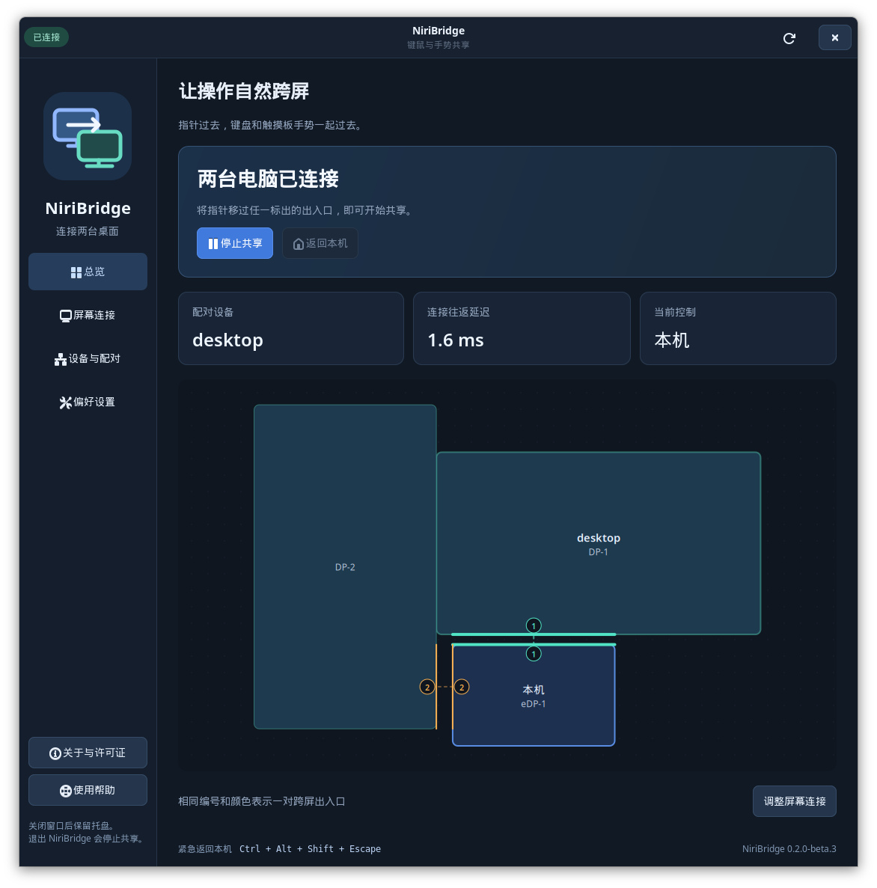

# NiriBridge

[English](README.md) · 简体中文

让键盘与触摸板手势跟随指针，在两台 Niri 桌面之间切换。

NiriBridge 在两台 Ubuntu/Niri/Wayland 电脑之间共享键盘、鼠标和触摸板，各自继续渲染本地桌面。指针穿过设置好的屏幕边缘后，键盘自动跟随；三指工作区切换和四指总览手势也在当前目标电脑执行。

**0.2 版新增原生桌面界面**，提供连接状态、暂停与启动、配对、屏幕连接和输入设备设置。英文是源语言和回退语言，简体中文翻译完整。界面默认跟随系统语言，也可在设置中手动切换，保留未保存的编辑，不重启输入共享。

当前为面向 Ubuntu 26.04 和 Niri 26.04 的早期测试版，采用 **GPL-3.0-or-later**。完整条款见 [LICENSE](LICENSE)，依赖声明见[第三方许可清单](THIRD_PARTY_NOTICES.md)。

## 桌面界面

从 [GitHub Releases](https://github.com/blackdream1890/niri-bridge/releases) 下载 Ubuntu 26.04 x86_64 压缩包，使用 `SHA256SUMS` 校验并解压，然后在解压目录执行：

```sh
python3 scripts/install.py
niri-bridge-ui
```

从 Git 源码构建时，先执行 `cargo build --locked --release`。单独提供的源码发行包附带锁定版本的 Rust 依赖；安装工具链和系统依赖后，可以离线完成 Cargo 构建。

安装后可从应用启动器打开 **NiriBridge**。安装程序保留现有身份、配对文件、设置、设备权限和自定义用户服务。升级运行中的程序时须同时更新两端；可用 `--no-restart` 安装后再一起重启服务。



截图使用演示设备名称、指纹和示例连接往返时间。

- **总览**：查看经过认证的连接状态、当前控制目标和实测连接往返时间。
- **屏幕连接**：拖动另一台电脑的屏幕组，选择入口显示器、调整入口范围，在一台保存即可通过现有加密连接同步两端。
- **设备与配对**：导出本机公开配对文件，检查对端文件并核对完整指纹后确认信任。
- **偏好设置**：选择实体输入设备、启用原生触摸板手势、管理自动启动和界面语言。
- **系统托盘**：打开界面、暂停或启动共享、退出界面。关闭窗口会保留后台共享服务。

界面管理标准的 `niri-bridge.service` 用户服务，并识别手动运行的独立进程，避免操作错误的实例。

## 配对与连接

1. 在两台电脑上打开 NiriBridge。已有配置会自动加载；首次使用时创建身份并选择共享的输入设备。
2. 分别导出配对文件，在另一台导入。将完整 SHA-256 指纹与对端界面的显示逐组核对，再确认信任。私钥始终留在原电脑。
3. 一台选择等待连接，另一台填写它可达的局域网地址和相同端口。
4. 如有需要，授权访问选定的输入设备，然后在两端启动共享。
5. 在“屏幕连接”中拖动另一台电脑、选择入口显示器并保存。两端都会先核对当前配置，再应用变化。

屏幕连接设置控制电脑之间的跨屏入口；每台电脑内部显示器的位置继续由 Niri 配置管理。完整依赖、设备授权、防火墙和恢复步骤见[安装与使用](docs/setup.zh-CN.md)。

## 日常行为

| 实体输入来源 | 指针所在电脑 | 键盘、指针与手势控制目标 |
| --- | --- | --- |
| 笔记本键盘和触摸板 | 笔记本 | 笔记本 |
| 笔记本键盘和触摸板 | 台式机 | 台式机 |
| 台式机键盘和鼠标 | 台式机 | 台式机 |
| 台式机键盘和鼠标 | 笔记本 | 笔记本 |

- **Ctrl+Alt+Shift+Escape** 立即返回输入来源电脑。普通 Escape 正常发送到目标电脑。
- 接收电脑的实体设备一有输入，即结束共享并恢复本机控制。
- 任一端锁屏、会话不活跃或状态不可用时暂停共享。解锁后可以重新跨屏，不自动恢复先前的输入独占。
- 可以继续使用 KDE Connect 同步剪贴板；NiriBridge 不另加一套剪贴板机制。

停止本机后台服务：

```sh
systemctl --user stop niri-bridge.service
```

## 实现与验证

Rust 后端使用双方证书认证的 TLS 1.3。选定的实体键盘事件在来源端输入法处理前读取，经目标端 uinput 支持 Niri 快捷键和输入法。原生触摸板帧保留时间信息，在本机或对端虚拟触摸板中处理，由目标 Niri 解释手势。鼠标使用 Wayland 捕获与虚拟指针协议。

GTK 界面通过仅限当前用户的私有 Unix socket 管理后端，不启动 Web 服务。配置写入保留 TOML 注释、拒绝过期编辑并使用原子替换。配对变更要求在界面中明确核对指纹。

最初两台 Ubuntu/Niri 设备已由用户确认双向输入、三指和四指手势，以及修正后的触摸板跟手程度。隔离合成器测试覆盖控制切换、恢复和双端配置更新。长期休眠、完整输入法编辑场景及所有扩展手势仍需继续验证，详见[测试覆盖](docs/testing.zh-CN.md)。

## 项目资料

- [安装与使用](docs/setup.zh-CN.md)
- [设计与安全边界](docs/design.zh-CN.md)
- [构建与测试](docs/testing.zh-CN.md)
- [贡献与翻译](CONTRIBUTING.zh-CN.md)
- [安全说明](SECURITY.zh-CN.md)
- [需求与验收清单](docs/requirements.zh-CN.md)

首个开发验证平台为 Ubuntu 26.04 和 Niri 26.04，其他合成器和操作系统尚未验证。项目通过 `rust-toolchain.toml` 固定 Rust 1.98.1。
